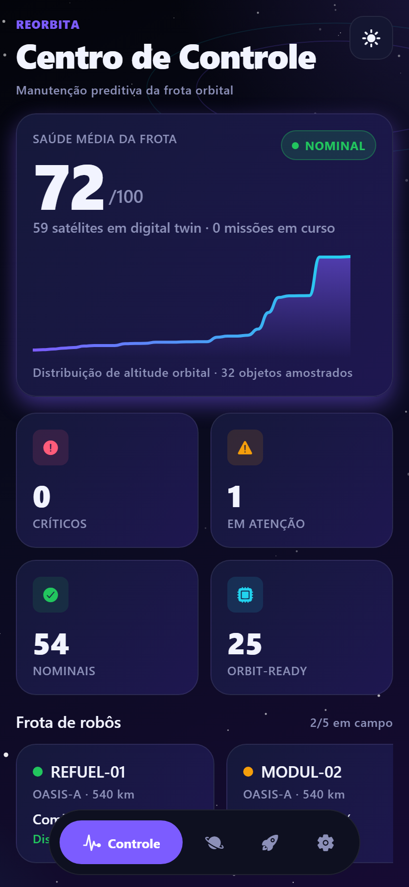
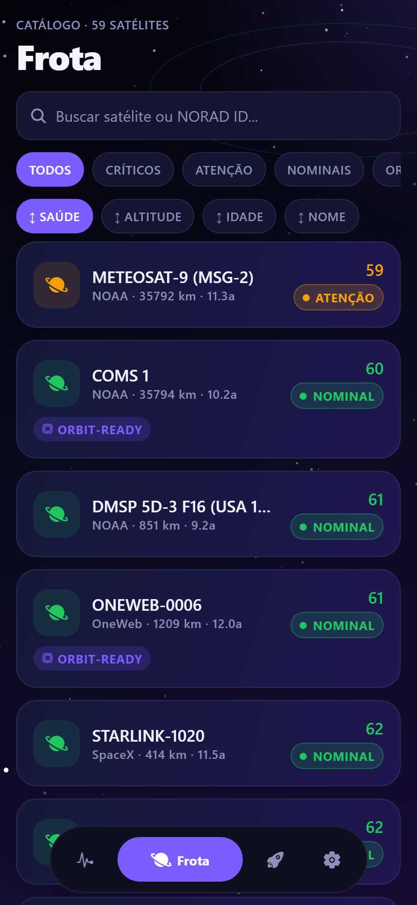
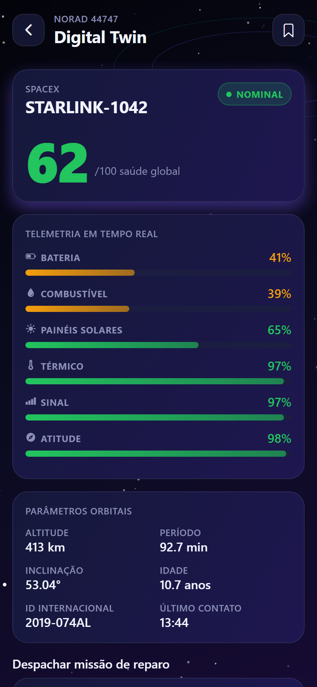
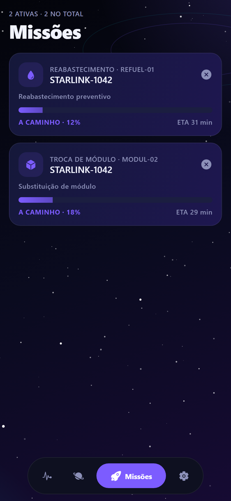
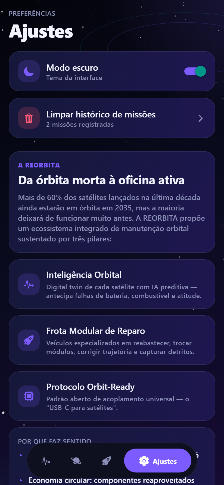

# REORBITA — Manutenção Orbital Inteligente

> "Construímos um cemitério a 400 km de altura. A REORBITA transforma esse cemitério em uma oficina."

Aplicação mobile em React Native + Expo + TypeScript que materializa o ecossistema REORBITA: digital twin de satélites em tempo real, frota de robôs de reparo coordenados e protocolo aberto de interoperabilidade orbital.

---

## O Problema

Mais de 60% dos satélites lançados na última década ainda estarão em órbita em 2035, mas a maioria deixará de funcionar muito antes — por falhas pontuais, baterias degradadas ou combustível esgotado. Cada um deles é um equipamento de milhões de dólares que vira lixo porque ninguém pode subir lá para apertar um parafuso.

## A Solução — Três Pilares

| Pilar | Descrição |
|-------|-----------|
| **Inteligência Orbital** | Digital twin de cada satélite com IA preditiva — antecipa falhas de bateria, combustível e atitude antes que o satélite morra. |
| **Frota Modular de Reparo** | Pequenos veículos especializados em reabastecimento, troca de módulos, descarte controlado e captura de detritos. |
| **Protocolo Orbit-Ready** | Padrão aberto de acoplamento universal — o "USB-C para satélites". |

### Alinhamento com ODS

- ODS 9 — Indústria, inovação e infraestrutura
- ODS 11 — Cidades e comunidades sustentáveis
- ODS 13 — Ação contra mudança climática

---

## O App

| Tela | Descrição |
|------|-----------|
| **Centro de Controle** | Saúde média da frota, distribuição de altitude, contadores de status (críticos, atenção, nominais, orbit-ready), frota de robôs, alertas preditivos e posição da ISS ao vivo. |
| **Frota** | Catálogo de satélites reais com busca por nome, operadora ou NORAD ID, filtros (críticos, atenção, nominais, orbit-ready) e ordenação (saúde, altitude, idade, nome). |
| **Digital Twin** | Telemetria detalhada (bateria, combustível, painéis, térmico, sinal, atitude), predição de falha estimada, parâmetros orbitais e despacho de missão de reparo. |
| **Missões** | Acompanhamento em tempo real das missões despachadas, com status, ETA, robô designado e motivo. |
| **Ajustes** | Tema claro/escuro, limpeza de histórico e apresentação dos três pilares da REORBITA. |

### Diferenciais visuais

- Tab bar customizada com microanimações (Reanimated)
- Cards com gradiente, sombras e efeito de brilho no foco
- Skeleton loaders animados durante o carregamento
- Contadores numéricos animados
- Barras de saúde com gradiente colorido por nível
- Gráfico em SVG suavizado
- Campo de estrelas e nebulosas no fundo (tema espacial)
- Tema escuro e tema claro com persistência

---

## Telas

| Centro de Controle | Frota | Digital Twin |
|:---:|:---:|:---:|
|  |  |  |

| Missões | Ajustes |
|:---:|:---:|
|  |  |

---

## Dados Reais

| API | Uso |
|-----|-----|
| CelesTrak (`celestrak.org/NORAD/elements/gp.php`) | TLEs de satélites reais (ISS, Starlink, OneWeb, NOAA, GPS, GOES) |
| Where the ISS at? (`api.wheretheiss.at/v1`) | Posição da ISS em tempo real |

A camada de telemetria de saúde e predição de falhas é gerada de forma determinística a partir do NORAD ID, de modo que cada satélite mantém números consistentes entre sessões e plausíveis em relação à sua idade real.

---

## Stack

- React Native + Expo + TypeScript
- React Navigation (Bottom Tabs + Native Stack)
- Reanimated
- expo-linear-gradient, react-native-svg
- Axios + AsyncStorage (persistência e cache)
- Context API (Tema, Missions, Watchlist)

---

## Estrutura

```
src/
  components/   Card, Skeleton, Chip, SparkChart, HealthBar, StatusPill, GradientBackground, Starfield, AnimatedNumber, EmptyState, Header
  contexts/     ThemeContext, MissionsContext, WatchlistContext
  hooks/        useFetch
  navigation/   RootNavigator + TabBar
  screens/      Dashboard, Fleet, TwinDetail, Missions, Settings
  services/     api, satellites (CelesTrak + ISS), telemetry
  storage/      wrapper de AsyncStorage com cache
  theme/        paleta, cores de status, spacing, radius, tipografia
  types/        Satellite, Telemetry, Robot, Mission
  utils/        formatadores
```

---

## Como rodar

```bash
npm install
npm start          # menu do Expo
npm run android    # Android
npm run ios        # iOS (macOS)
npm run web        # Web
```

---

## Integrantes

| Nome | RM |
|------|----|
| Ricardo Di Tilia | RM555155 |
| Bento Rangel | RM559124 |
| Eric Yuji | RM554869 |
| Kaue Pires | RM554403 |
| Higor Batista | RM558907 |

---

Projeto acadêmico — Global Solution.
